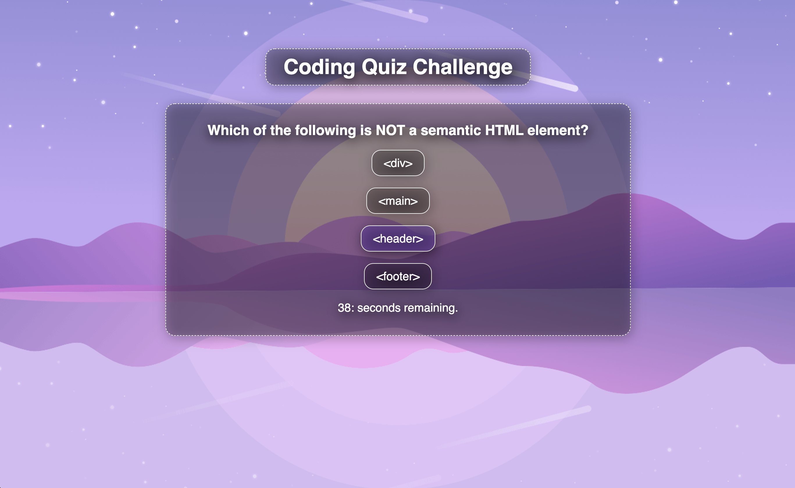
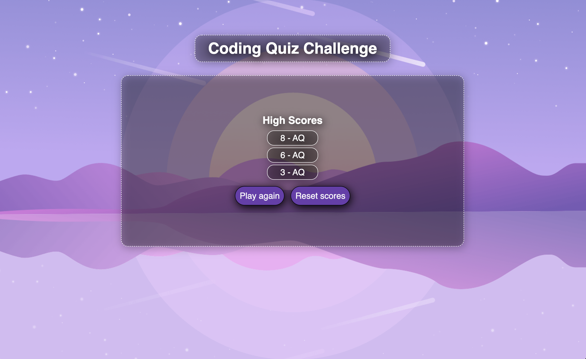

# Coding-Quiz
A timed coding quiz with randomized multiple choice questions and local leaderboard.

## Overview
The purpose of this project was to create an interactive quiz that tests the user's basic coding knowledge. The application features various different interactive screens where the user can answer questions, record their high score, check their local leaderboards, and play again.

Upon clicking the "Start Quiz" button, the user is prompted with a countdown of three seconds. Once that counter hits zero the user has sixty seconds to answer ten random questions. If the user chooses an incorrect answer then ten seconds are removed from the quiz timer. 

When the quiz is over the user has the option of recording their initials and storing their record to their local leaderboard. They are also given the choice of playing again or clearing the leaderboard.

## What it looks like

## The live page
The live page can be found by clicking [here.](https://tonyq032.github.io/Coding-Quiz/) 